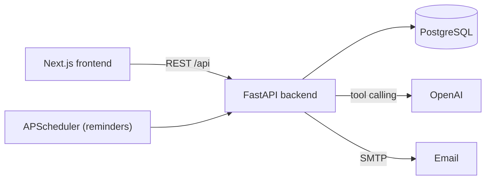

# Symptoms Sense

An AI-assisted health companion. Describe how you feel, get pointed to the right kind of specialist, and book the appointment or set a medicine reminder, all from one conversation.

> **Not medical advice.** Symptoms Sense gives general health information and never diagnoses. In an emergency, call your local emergency number. The data and photos in the demo are fictional or stock images.

[](LICENSE)

## Features

- **AI health assistant** with real tool calling: symptom assessment, urgency flags, doctor search, live availability, and booking, cancelling or rescheduling appointments. Every change is only a *proposal* until the user taps **Confirm**.
- **Medicine reminders** by email, on the days and times you choose, set from a form or from the chat.
- **Doctor directory** with profiles, schedules, clinic details and patient reviews.
- **Role-based accounts:** patients, doctors and clinics, each with their own onboarding and dashboard. Email and Google sign-in.
- **Saved conversations** with the booking, reminder and appointment cards preserved.
- **HTML email templates** for reminders and notifications.

## Tech stack

| Layer | Technology |
|---|---|
| Frontend | Next.js 14 (App Router), React 18, TypeScript, Tailwind CSS, shadcn/ui, Radix UI |
| Backend | FastAPI, SQLAlchemy 2, Alembic, Pydantic 2, APScheduler |
| Database | PostgreSQL |
| AI | OpenAI chat completions with function calling (`gpt-4o-mini`) |
| Auth | JWT access and refresh tokens, Google OAuth 2.0 |
| Packaging | Docker and Docker Compose |

## How it fits together



The chat agent (`Backend/app/medical_chat`) reads the conversation, calls tools (search doctors, get slots, propose booking, propose reminder), and returns text plus UI cards. Writes happen only through a separate confirm endpoint.

## Getting started

### Prerequisites

- Node.js 18.17+ (20 recommended) and npm
- Python 3.11+ (3.12 is used in Docker)
- PostgreSQL 14+ running locally
- An OpenAI API key (needed for the chat assistant)

### 1. Clone

```bash
git clone https://github.com/junaid-1013/Symptoms-Sense.git
cd Symptoms-Sense
```

### 2. Backend

```bash
cd Backend
python -m venv venv && source venv/bin/activate
pip install -r requirements.txt
cp .env.sample .env        # then fill in DATABASE_URL, SECRET_KEY, OPENAI_API_KEY
alembic upgrade head
uvicorn app.main:app --reload --port 8000
```

Check `http://localhost:8000/health`. Interactive API docs are at `http://localhost:8000/docs` in development. More detail: [Backend/README.md](Backend/README.md).

### 3. Frontend

```bash
cd Frontend
npm install
cp .env.sample .env        # NEXT_PUBLIC_BACKEND_URL=http://localhost:8000/api/
npm run dev
```

Open `http://localhost:3000`. More detail: [Frontend/README.md](Frontend/README.md).

## Project structure

```
Symptoms-Sense/
├── Backend/            FastAPI app, Alembic migrations, Docker files
│   ├── app/            Feature modules (auth, doctors, appointments, reminders, medical_chat, ...)
│   └── alembic/        Database migrations
├── Frontend/           Next.js app
│   ├── src/app/        Routes (App Router)
│   ├── src/components/ UI and feature components
│   └── src/endPoints/  API client calls
├── docs/               Operations and maintainer guides
└── .github/            CI, issue and PR templates, branch ruleset
```

## Documentation

- [Backend guide](Backend/README.md) and [operations guide](docs/backend-operations.md) (mail, reminders, avatars, Docker, AWS)
- [Frontend guide](Frontend/README.md)
- [Contributing](CONTRIBUTING.md), [Code of Conduct](CODE_OF_CONDUCT.md), [Security policy](SECURITY.md)
- [Branch protection setup](docs/BRANCH_PROTECTION.md) (for maintainers)

## Contributing

Contributions are welcome. Please read [CONTRIBUTING.md](CONTRIBUTING.md) first. The `main` branch is protected, so all changes arrive through pull requests from a fork or a branch.

## Team

| Name | GitHub | LinkedIn | Portfolio |
|---|---|---|---|
| Junaid Ali Bhatti | [junaid-1013](https://github.com/junaid-1013) | [profile](https://www.linkedin.com/in/junaid-ali-bhatti-101452/) | [junaidalibhatti.vercel.app](https://junaidalibhatti.vercel.app) |
| Dilawar Ali | [Dilawar4Ali](https://github.com/Dilawar4Ali) | [profile](https://www.linkedin.com/in/dilawar-ali-thaheem-368707212/) | - |
| Ayesha Mubashir | [ayeeshaa5](https://github.com/ayeeshaa5) | [profile](https://www.linkedin.com/in/ayesha-mubashir-008169275/) | - |
| Humera Akmal | [humerahub](https://github.com/humerahub) | [profile](https://www.linkedin.com/in/humera-akmal-4a0b482a4/) | - |

See also the [contributors graph](https://github.com/junaid-1013/Symptoms-Sense/graphs/contributors).

## License

Licensed under the [Apache License 2.0](LICENSE).
